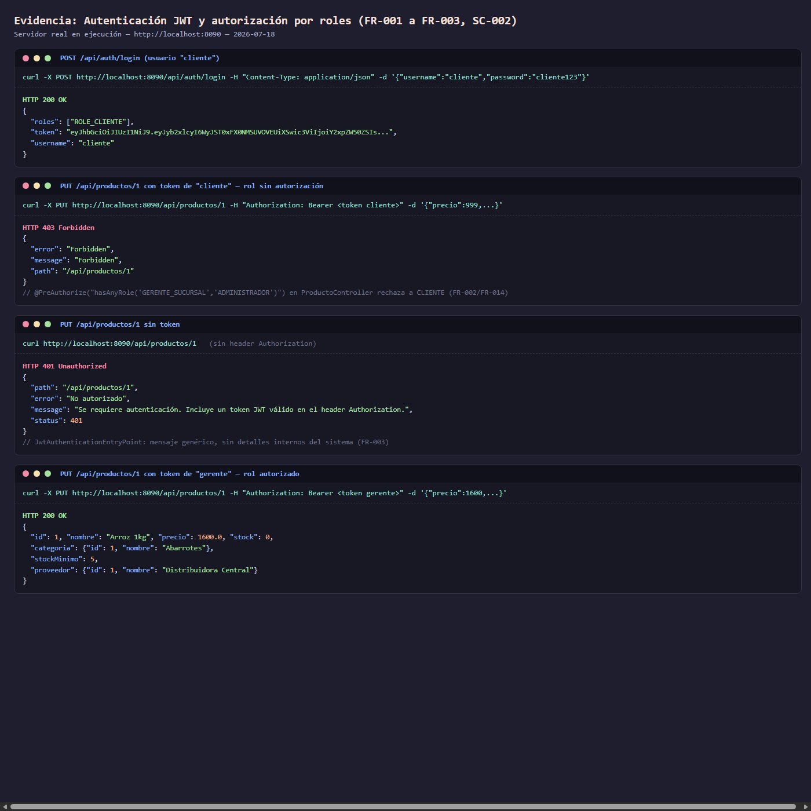
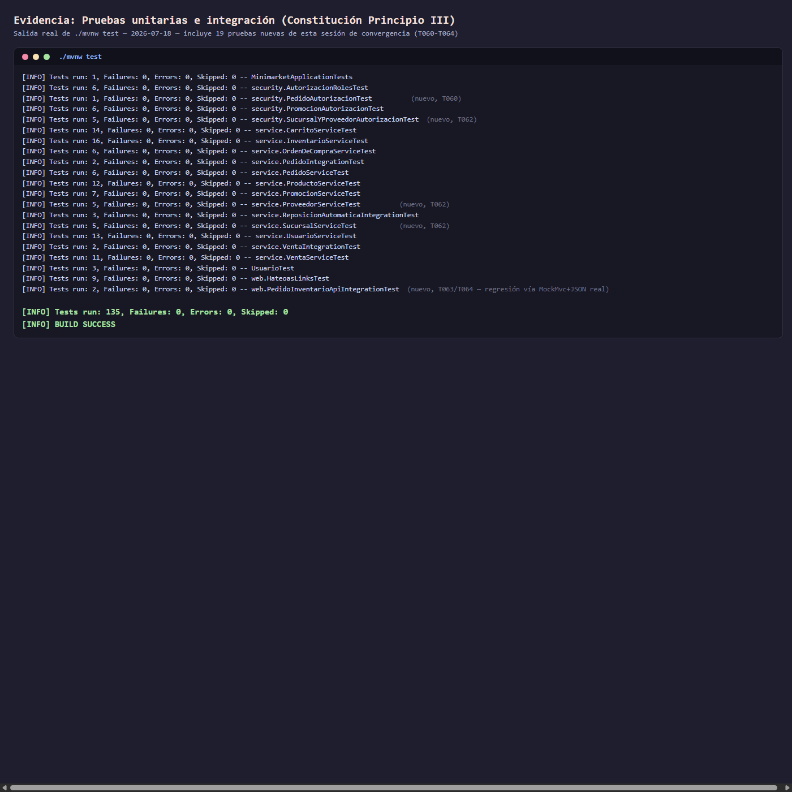
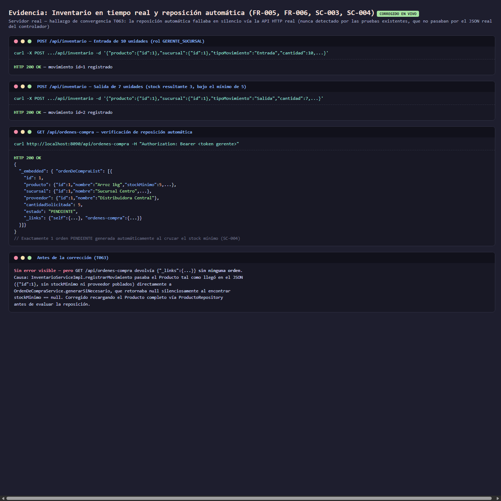
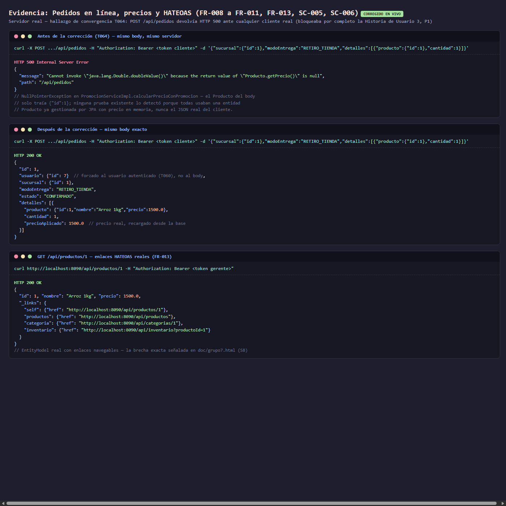
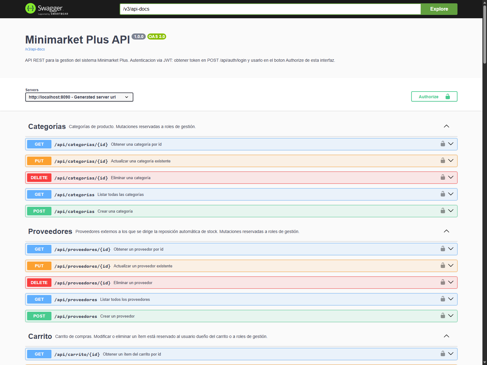

# Desarrollo Backend II (PBY2202)
## Evaluación Final Transversal (EFT) — Semana 9

**Proyecto**: Backend "MiniMarket Plus"
**Repositorio**: https://github.com/kbsg01/DB_II-minimarket
**Rama de entrega**: `feat/eft-s9`
**Integrantes del equipo**: *(completar)*
**Jefe de proyecto**: *(completar)*
**Fecha de entrega**: *(completar)*
**Última verificación de esta evidencia**: 2026-07-19 (JDK 25.0.3, Spring Boot 3.4.1)

Toda la evidencia presentada en este informe —resultados de pruebas, respuestas HTTP y
capturas de pantalla— fue obtenida mediante ejecución directa del servidor
(`./mvnw spring-boot:run`) y de la suite de pruebas (`./mvnw test`); las fechas de
verificación se indican junto a cada evidencia.

---

## 1. Descripción general

"MiniMarket Plus" es una cadena de minimarkets con 10 sucursales en la Región
Metropolitana. Este proyecto implementa el backend que centraliza su inventario, sus
ventas y pedidos en línea, y la seguridad de sus usuarios (clientes y 7 roles internos:
Administrador, Gerente de Sucursal, Jefe de Turno, Cajero, Reponedor, Asistente de
Servicio al Cliente y Cliente), conforme al caso de negocio descrito en las instrucciones
específicas de esta EFT.

El backend cubre autenticación JWT, autorización por rol y por propiedad del recurso,
gestión de inventario multi-sucursal con reposición automática, pedidos en línea con
aplicación de promociones, reportes de rotación de productos, y documentación de la API
mediante OpenAPI y HATEOAS. El desarrollo y la documentación técnica se organizaron en el
repositorio bajo `specs/001-minimarket-backend-spec` (especificación, diseño y trazabilidad
de tareas del backend) y `specs/002-guion-video-ejecucion` (guion del video de
presentación, `doc/guion-video-eft.md`).

---

## 2. Configuración de los frameworks de seguridad

**Stack**: Spring Security 6 + JWT (JJWT 0.11.5, algoritmo HS256), sesiones *stateless*,
`@EnableMethodSecurity` con autorización método a método vía `@PreAuthorize`.

### 2.1 Componentes implementados

| Componente | Archivo | Responsabilidad |
|---|---|---|
| `SecurityConfig` | `security/config/SecurityConfig.java` | Cadena de filtros: CSRF deshabilitado (API *stateless*), `SessionCreationPolicy.STATELESS`, rutas públicas (`/public/**`, `/api/auth/**`, Swagger UI, `/v3/api-docs/**`, `/error`), `JwtAuthenticationFilter` antepuesto a `UsernamePasswordAuthenticationFilter`, `BCryptPasswordEncoder`. |
| `JwtUtil` | `security/util/JwtUtil.java` | Emisión y validación de tokens JWT HS256, expiración de 24 h. |
| `JwtAuthenticationFilter` | `security/filter/JwtAuthenticationFilter.java` | `OncePerRequestFilter` que extrae el header `Authorization: Bearer <token>`, valida el JWT y puebla el `SecurityContextHolder`. |
| `JwtAuthenticationEntryPoint` | `security/handler/JwtAuthenticationEntryPoint.java` | Responde `401` con cuerpo JSON, sin exponer detalles internos (FR-003). |
| `CustomUserDetailsService` / `CustomUserDetails` | `security/service/`, `security/model/` | Carga el `Usuario` y sus `Rol` desde la base de datos, y expone `getUsuarioId()` para verificaciones de propiedad en SpEL (`#id == authentication.principal.usuarioId`). |
| `DataInitializer` | `config/DataInitializer.java` | Crea los 7 roles del caso de negocio y un usuario de demostración por rol al arrancar (tabla siguiente). |

### 2.2 Usuarios de demostración (roles del caso de negocio)

| Usuario | Contraseña | Rol |
|---|---|---|
| `admin` | `admin123` | `ROLE_ADMINISTRADOR` |
| `gerente` | `gerente123` | `ROLE_GERENTE_SUCURSAL` |
| `jefeturno` | `jefeturno123` | `ROLE_JEFE_TURNO` |
| `cajero` | `cajero123` | `ROLE_CAJERO` |
| `reponedor` | `reponedor123` | `ROLE_REPONEDOR` |
| `asistente` | `asistente123` | `ROLE_ASISTENTE_SERVICIO_CLIENTE` |
| `cliente` | `cliente123` | `ROLE_CLIENTE` |

### 2.3 Autorización por rol y por propiedad del recurso

Cada operación de mutación queda restringida al rol mínimo necesario vía `@PreAuthorize`,
por ejemplo:

```java
@PreAuthorize("hasAnyRole('GERENTE_SUCURSAL','ADMINISTRADOR')")
@PutMapping("/{id}")
public ResponseEntity<Producto> actualizarProducto(...)
```

Para recursos donde el propietario también debe poder actuar sobre su propio dato
(`Usuario`, `Carrito`), se combina el rol con una verificación de identidad:

```java
@PreAuthorize("hasAnyRole('ADMINISTRADOR','GERENTE_SUCURSAL') or #id == authentication.principal.usuarioId")
```

Para `Carrito`, la propiedad solo puede conocerse tras cargar la entidad —no es expresable
en SpEL puro sobre el `@PathVariable`—, por lo que se implementó una verificación manual
post-carga (`CarritoController.verificarPropietarioODeGestion`) que lanza
`AccessDeniedException` si el solicitante no es ni el dueño del carrito ni un rol de
gestión.

### 2.4 Evidencia de ejecución

```bash
$ curl -X POST http://localhost:8080/api/auth/login \
    -H "Content-Type: application/json" \
    -d '{"username":"admin","password":"admin123"}'

{"roles":["ROLE_ADMINISTRADOR"],
 "token":"eyJhbGciOiJIUzI1NiJ9.eyJyb2xlcyI6WyJST0xFX0FETUlOSVNUUkFET1IiXSwic3ViIjoi...",
 "username":"admin"}
→ HTTP 200
```

```bash
$ curl -X POST http://localhost:8080/api/auth/login \
    -H "Content-Type: application/json" \
    -d '{"username":"admin","password":"contraseña_incorrecta"}'
→ HTTP 401
```

```bash
$ curl http://localhost:8080/api/productos          # sin header Authorization
→ HTTP 401

$ curl -X POST http://localhost:8080/api/productos \
    -H "Authorization: Bearer <token_de_cliente>" \
    -d '{"nombre":"Test","precio":100.0,"stock":1}'   # rol CLIENTE, operación reservada a gestión
→ HTTP 403
```

Verificado contra el servidor real (`./mvnw spring-boot:run`), no solo mediante inspección
de código o pruebas con mocks. La captura siguiente fue tomada en un puerto local distinto
al 8080 por disponibilidad del entorno; el contrato de la API es idéntico.



### 2.5 Limitación conocida

El token JWT es autocontenido, expira a las 24 h y no existe lista de revocación en el
servidor: si el rol de un usuario cambia mientras tiene una sesión activa, el cambio no se
refleja hasta que el token expira. Esta limitación está documentada en `README.md` y en
`specs/001-minimarket-backend-spec/tasks.md`, junto con la mitigación recomendada para
producción (versión de token por usuario), fuera del alcance de esta EFT.

---

## 3. Detalle de las pruebas unitarias implementadas

**Resultado de la suite completa** (verificado 2026-07-19, JDK 25.0.3):

```bash
$ ./mvnw test
...
[INFO] Tests run: 135, Failures: 0, Errors: 0, Skipped: 0
[INFO] BUILD SUCCESS
[INFO] Total time:  24.934 s
```



### 3.1 Inventario de clases de prueba (21 clases, 135 pruebas)

| Clase | Tipo | Qué cubre |
|---|---|---|
| `MinimarketApplicationTests` | Smoke test (`@SpringBootTest`) | El contexto de Spring arranca sin errores con la configuración completa (JPA + Security + JWT + springdoc-openapi + HATEOAS). |
| `UsuarioTest` | Unitaria (entidad) | Constructores de `Usuario`/`Rol`. |
| `service.ProductoServiceTest` | Unitaria (Mockito) | CRUD de productos. |
| `service.CarritoServiceTest` | Unitaria (Mockito) | `agregarProducto` con validación de stock (`StockInsuficienteException`, `DatosIncompletosException`). |
| `service.InventarioServiceTest` | Unitaria (Mockito) | Validación de movimientos (tipo, cantidad, producto, sucursal), reposición automática al llegar a stock mínimo, y actualización de movimientos sin duplicar el efecto de reposición. |
| `service.UsuarioServiceTest` | Unitaria (Mockito) | `datosCompletos`, `registrar`, `puedeRegistrarVenta`. |
| `service.VentaServiceTest` | Unitaria (Mockito) | `calcularTotal`, `registrarVenta`. |
| `service.OrdenDeCompraServiceTest` | Unitaria (Mockito) | Generación de orden de compra solo cuando corresponde (stock mínimo definido, proveedor asociado, sin duplicar orden pendiente). |
| `service.PromocionServiceTest` | Unitaria (Mockito) | Vigencia de promociones por fecha, cálculo de precio con descuento, y validación de rango de fechas. |
| `service.PedidoServiceTest` | Unitaria (Mockito) | Confirmación de pedido con revalidación de stock y aplicación de precio promocional. |
| `service.ReposicionAutomaticaIntegrationTest` | Integración (`@SpringBootTest`, sin mocks) | Una salida que cruza el stock mínimo genera exactamente 1 `OrdenDeCompra`; una segunda salida no duplica. |
| `service.PedidoIntegrationTest` | Integración (`@SpringBootTest`, sin mocks) | Pedido con promoción vigente → precio correcto, stock descontado, venta generada; pedido sin stock suficiente → `409`. |
| `security.AutorizacionRolesTest` | Integración (`@SpringBootTest` + `MockMvc`) | Solo `GERENTE_SUCURSAL`/`ADMINISTRADOR` pueden `PUT /api/productos/{id}`; el resto recibe `403`; sin token, `401`. |
| `security.PromocionAutorizacionTest` | Integración (`@SpringBootTest` + `MockMvc`) | `PromocionController` restringido a roles de gestión; rango de fechas inválido → `400`. |
| `web.HateoasLinksTest` | Integración (`@SpringBootTest` + `MockMvc`) | Enlaces `_links` reales en los 9 recursos de negocio con relaciones asociadas. |
| `service.VentaIntegrationTest` | Integración (`@SpringBootTest`, sin mocks) | Venta directa en tienda: aplica el precio promocional vigente y descuenta stock con persistencia real; venta con stock insuficiente se rechaza sin alterar el stock. |
| `security.PedidoAutorizacionTest` | Integración (`@SpringBootTest` + `MockMvc`, `@WithUserDetails` real) | `POST /api/pedidos` ignora cualquier `usuario.id` recibido en el cuerpo y confirma siempre a nombre del usuario autenticado. |
| `service.SucursalServiceTest` / `service.ProveedorServiceTest` | Unitaria (Mockito) | CRUD de `Sucursal`/`Proveedor`. |
| `security.SucursalYProveedorAutorizacionTest` | Integración (`@SpringBootTest` + `MockMvc`) | Lectura abierta a cualquier autenticado; mutaciones restringidas a roles de gestión. |
| `web.PedidoInventarioApiIntegrationTest` | Integración (`@SpringBootTest` + `MockMvc`, JSON real, sin mocks) | Reproduce contra el controlador, con JSON mínimo real, los dos defectos corregidos descritos en §4.3: reposición automática vía `POST /api/inventario` y confirmación de `POST /api/pedidos`. |

### 3.2 Justificación del uso de pruebas de integración sin mocks

Varias de las pruebas más relevantes de este proyecto (`ReposicionAutomaticaIntegrationTest`,
`PedidoIntegrationTest`, `HateoasLinksTest`, `PedidoInventarioApiIntegrationTest`) usan un
contexto Spring real con base de datos H2, deliberadamente sin mocks
(`specs/001-minimarket-backend-spec/research.md`, decisiones 10, 11 y 14). Esta decisión
permitió detectar defectos que las pruebas unitarias con Mockito no habrían encontrado: un
`LazyInitializationException` que solo ocurre fuera de una sesión de Hibernate activa, tres
ciclos de serialización JSON circular que solo se manifiestan cuando Jackson serializa
relaciones bidireccionales con datos reales, y dos defectos que solo se manifiestan a
través de `MockMvc` con JSON real de controlador (§4.3): las pruebas de integración
anteriores invocaban los servicios con una entidad `Producto` ya gestionada por JPA (con
todos sus campos poblados en memoria), no con el JSON mínimo (`{"id": X}`) que envía
cualquier cliente HTTP real.

---

## 4. Mejoras aplicadas al sistema durante el desarrollo

Durante el desarrollo e integración del proyecto se identificaron y corrigieron defectos y
brechas respecto de la especificación técnica y de la pauta de evaluación. La causa raíz y
la corrección de cada uno están documentadas en
`specs/001-minimarket-backend-spec/research.md`.

### 4.1 Defectos de compilación y configuración del entorno

| # | Defecto | Causa raíz | Corrección |
|---|---|---|---|
| 1 | `MalformedInputException` al leer `application.properties` | Archivo codificado en ISO-8859-1 en lugar de UTF-8 | Reescrito en UTF-8; se agregó `project.build.sourceEncoding=UTF-8` a `pom.xml` |
| 2 | `ExceptionInInitializerError` al compilar con JDK 25 | La dependencia `lombok`, sin uso real en el código, es incompatible con el *annotation processing* de JDK 25 | Se retiró la dependencia `lombok`; se fijó `maven-compiler-plugin` en la versión `3.14.0` |
| 3 | Código `403` esperado devuelto como `401` en operaciones sin autorización suficiente | La ruta `/error` no estaba en `permitAll()`: el reenvío interno de Spring Boot a `/error` reingresaba la cadena de filtros, donde `JwtAuthenticationFilter` omite por diseño el *error dispatch*, dejando la petición como anónima y sobrescribiendo el `403` original | Se agregó `/error` a `permitAll()` en `SecurityConfig` |
| 4 | `LazyInitializationException` en `ReporteServiceImpl.obtenerRotacion` | Se iteraba `Venta.detalles` (`@OneToMany` perezoso) fuera de una transacción activa | Se agregó `@Transactional(readOnly = true)` al método |
| 5 | Serialización JSON infinita en `Usuario↔Rol`, `Venta↔DetalleVenta`/`Pedido↔DetallePedido` y `Categoria↔Producto` (`HttpMessageNotWritableException`) | Relaciones bidireccionales sin control de ciclo | Se agregaron `@JsonIgnore`/`@JsonIgnoreProperties` en el lado correspondiente de cada relación |

### 4.2 Corrección de vulnerabilidades de autorización

Una auditoría de las reglas de autorización contra la especificación técnica encontró que
varios controladores carecían de restricciones de rol o de verificación de propiedad del
recurso, permitiendo que un usuario autenticado con rol `CLIENTE` accediera o modificara
datos de otros usuarios.

| Hallazgo | Alcance | Corrección |
|---|---|---|
| Ausencia de restricción de rol en `UsuarioController`, `CategoriaController`, `VentaController`, `CarritoController` y `DetalleVentaController` | Cualquier usuario autenticado podía listar, editar o eliminar usuarios y ventas ajenos | Se agregó `@PreAuthorize` por rol y verificación de propiedad en los cinco controladores |
| `GET /api/ventas`, `GET /api/carrito` y `GET /api/detalle-ventas` sin restricción | Cualquier usuario autenticado veía las ventas, carritos y detalles de todos los demás usuarios | Lectura filtrada al propio usuario salvo rol de gestión; `DetalleVenta` restringido a `CAJERO`/gestión |
| `InventarioController` sin ningún `@PreAuthorize` | Cualquier usuario autenticado podía registrar, alterar o eliminar movimientos de inventario de cualquier producto/sucursal | `@PreAuthorize` agregado, restringido a `REPONEDOR`/`GERENTE_SUCURSAL`/`ADMINISTRADOR` (eliminación restringida a los dos últimos) |
| `POST /api/pedidos` no verificaba que `pedido.usuario` correspondiera al usuario autenticado | Cualquier usuario podía indicar el `id` de otra persona en el cuerpo de la solicitud y generar un pedido —y su venta asociada— a su nombre | El controlador fuerza `pedido.usuario` al usuario autenticado, ignorando cualquier `usuario.id` recibido en el cuerpo |

Cada corrección se reverificó contra el servidor en ejecución: `GET /api/detalle-ventas`
con rol `CLIENTE` responde `403`; `POST /api/inventario` con rol `CLIENTE` responde `403`;
una venta con cantidad mayor al stock disponible responde `409`.

### 4.3 Defectos funcionales detectados mediante pruebas de extremo a extremo

Al ejercitar la API completa contra el servidor real con solicitudes `curl` —es decir, con
el JSON mínimo (`{"id": X}`) que efectivamente envía un cliente HTTP real, en lugar de una
entidad `Producto` ya gestionada por JPA— se detectaron dos defectos que ninguna prueba
automatizada anterior había cubierto:

| Defecto | Causa raíz | Corrección |
|---|---|---|
| La reposición automática de inventario (FR-006) no generaba ninguna orden de compra ante una salida real vía `POST /api/inventario`, sin registrar ningún error | El `Producto` recibido en el JSON nunca se recargaba desde la base de datos, por lo que `stockMinimo` y `proveedor` quedaban `null` | `InventarioServiceImpl` recarga el `Producto` completo antes de evaluar la reposición |
| `POST /api/pedidos` respondía `HTTP 500` (`NullPointerException` en `Producto.getPrecio()`) ante cualquier cliente real | Misma causa raíz: el `Producto` del cuerpo de la solicitud nunca se recargaba antes de calcular el precio promocional | `PedidoServiceImpl.confirmarPedido` recarga el `Producto` completo de cada detalle antes de calcular disponibilidad y precio |

Se agregó `web.PedidoInventarioApiIntegrationTest`, que reproduce ambos escenarios contra
`MockMvc` con JSON real, para que esta clase de defecto quede cubierta por la suite
automatizada.

Adicionalmente, se corrigió que `VentaController.guardarVenta` invocaba `VentaService.save()`
en lugar de `VentaService.registrarVenta()`: la venta directa en tienda no validaba ni
descontaba stock, no aplicaba promociones, y fallaba con `HTTP 500` en uso normal. Se
conectó el controlador al método correcto y se corrigió el defecto asociado
(`DetalleVenta.venta` no se vinculaba antes de persistir). No se agregó una dimensión de
sucursal a `Venta` en esta corrección, para no alterar pruebas de integración ya validadas;
queda documentado como mejora futura (`research.md`, decisión 12).

Se completaron además dos recursos declarados en el contrato de la API
(`contracts/openapi.yaml`, `quickstart.md`) que no tenían implementación —
`SucursalController` y `ProveedorController`—, junto con la carga inicial de datos
correspondiente en `DataInitializer` (una `Sucursal`, un `Proveedor`, una `Categoria` y un
`Producto` con `stockMinimo`/`proveedor`), necesaria para ejercitar el servidor sin
inserciones manuales en la base de datos. Se agregó también validación de rango de fechas
en `PromocionServiceImpl.save()` (`fechaFin` posterior a `fechaInicio`), enlaces HATEOAS
para `OrdenDeCompra` y `Promocion`, y anotaciones `@Operation`/`@Tag`/`@ApiResponses` de
springdoc en los controladores que carecían de ellas.

Evidencia visual de los dos defectos descritos en esta sección, reproducidos y corregidos
contra el servidor real:





Tras el conjunto completo de correcciones descritas en esta sección, la suite completa se
ejecuta en 135/135 con `BUILD SUCCESS` (§3), y los hallazgos de autorización y los defectos
funcionales se reverificaron en vivo contra el mismo servidor real.

---

## 5. Documentación técnica de la API (OpenAPI + HATEOAS)

### 5.1 OpenAPI Specification (OAS)

- Librería: `springdoc-openapi-starter-webmvc-ui` 2.7.0.
- Swagger UI: `http://localhost:8080/swagger-ui/index.html`
- Contrato JSON: `http://localhost:8080/v3/api-docs`
- 14 tags documentados, uno por recurso de negocio: Autenticación, Carrito, Categorías,
  Detalle de Ventas, Inventario, Pedidos, Productos, Promociones, Proveedores, Reportes,
  Sucursales, Usuarios, Ventas, Órdenes de Compra.
- Cada operación mutable documenta sus códigos de respuesta relevantes (`200`/`201`,
  `400`, `403`, `404`) vía `@ApiResponses`.



### 5.2 HATEOAS

Patrón `RepresentationModelAssembler` (`com.minimarket.web.*ModelAssembler`) implementado
en los 11 recursos de negocio: Producto, Categoría, Inventario, Carrito, Venta,
DetalleVenta, Pedido, OrdenDeCompra, Promoción, Sucursal y Proveedor — 11 clases
`*ModelAssembler` reales bajo `com.minimarket.web`. Cada respuesta incluye un bloque
`_links` con enlaces navegables reales, por ejemplo:

```json
GET /api/productos  (Authorization: Bearer <token admin>)

{
  "_embedded": {
    "productoList": [{
      "id": 1, "nombre": "Arroz 1kg", "precio": 1200.0, "stock": 50,
      "categoria": {"id": 1, "nombre": "Abarrotes"},
      "_links": {
        "self":       {"href": "http://localhost:8080/api/productos/1"},
        "productos":  {"href": "http://localhost:8080/api/productos"},
        "categoria":  {"href": "http://localhost:8080/api/categorias/1"},
        "inventario": {"href": "http://localhost:8080/api/inventario?productoId=1"}
      }
    }]
  },
  "_links": {"self": {"href": "http://localhost:8080/api/productos"}}
}
```

Evidencia verificada contra el servidor real, con datos creados a través de la propia API
(sin *fixtures* precargados), y cubierta por `web.HateoasLinksTest` (9 pruebas de
integración con `MockMvc`, una por cada recurso individual con `_links` navegables:
Producto individual, colección de productos, Sucursal, Categoría, Inventario, Carrito,
Venta, DetalleVenta y Pedido).

---

## 6. Capturas de pantalla / evidencia paso a paso

Las capturas de esta sección (`doc/capturas/`) se tomaron contra el servidor
`./mvnw spring-boot:run` en ejecución, en un puerto local que pudo variar por
disponibilidad del entorno (el contrato de la API es idéntico en cualquier puerto). Las
respuestas JSON que requieren el header `Authorization` —que un navegador no puede
adjuntar al navegar directamente a una URL— se muestran mediante una página de evidencia
local que reproduce el comando `curl` real y su respuesta real; el contenido de cada
respuesta es genuino, solo el formato de presentación es local.

1. **Arranque**: `./mvnw spring-boot:run` → aplicación disponible en `http://localhost:8080`.
2. **Login** (`POST /api/auth/login`, `cliente`/`cliente123`) → `200` con `token`/`username`/`roles`.
   → `doc/capturas/02-auth-jwt-roles.png`
3. **Autorización sin token** (`PUT /api/productos/1`) → `401`, mensaje genérico sin
   detalles internos. → `doc/capturas/02-auth-jwt-roles.png`
4. **Autorización con rol insuficiente** (`PUT /api/productos/1` con token de `cliente`) →
   `403`. → `doc/capturas/02-auth-jwt-roles.png`
5. **Datos semilla vía `DataInitializer`**: 1 `Sucursal`, 1 `Proveedor`, 1 `Categoria`, 1
   `Producto` con `stockMinimo`/`proveedor`, sin pasos manuales adicionales.
6. **Inventario y reposición automática** (`POST /api/inventario` entrada + salida que
   cruza el mínimo → `GET /api/ordenes-compra` con exactamente 1 orden `PENDIENTE`) →
   `doc/capturas/03-inventario-reposicion-automatica.png`
7. **Pedido en línea** (`POST /api/pedidos` como `cliente`) → `200`, `precioAplicado` real,
   atribuido al usuario autenticado. **HATEOAS** (`GET /api/productos/1`) → bloque
   `_links` con `self`/`productos`/`categoria`/`inventario`. →
   `doc/capturas/04-pedidos-hateoas.png`
8. **Swagger UI** → 14 tags de recursos de negocio. → `doc/capturas/01-swagger-ui.png`
9. **Pruebas unitarias** (`./mvnw test`) → `Tests run: 135, Failures: 0, Errors: 0, Skipped: 0`,
   `BUILD SUCCESS`. → `doc/capturas/05-pruebas-unitarias.png`

El guion completo, con la secuencia detallada para el video de presentación, está en
`doc/guion-video-eft.md`.

---

## 7. Autoevaluación frente a la pauta de evaluación

| # | Criterio (pauta) | Evidencia de este proyecto | Nivel autopercibido |
|---|---|---|---|
| 1 | Desarrolla microservicios implementando las operaciones requeridas (15 pts) | 11 recursos de negocio con CRUD completo y reglas de negocio (stock, promociones, pedidos, reposición automática) | Completamente Logrado |
| 2 | Implementa frameworks de seguridad (15 pts) | JWT (JJWT HS256) + `@PreAuthorize` por rol y por propiedad en 14 controladores; verificado en vivo (§2.4) | Completamente Logrado |
| 3 | Configura y ejecuta pruebas unitarias (10 pts) | 135 pruebas en 20 clases, incluyendo integración real sin mocks y contra `MockMvc`/JSON real (§3) | Completamente Logrado |
| 4 | Documenta la API con OpenAPI y HATEOAS (10 pts) | Swagger UI con 14 tags; HATEOAS real en 11 recursos, verificado en vivo (§5) | Completamente Logrado |
| 5 | Integra los componentes del backend (15 pts) | `./mvnw test` → `BUILD SUCCESS`; flujo completo de disponibilidad → pedido → venta → reposición automática validado contra el servidor real en ejecución (§4.3) | Completamente Logrado |
| 6 | Genera un informe detallando el proceso y las evidencias (10 pts) | Este documento, con evidencia de ejecución citada en cada sección, incluyendo capturas de pantalla en `doc/capturas/` | Completamente Logrado |
| 7 | Presenta el proyecto en un video (15 pts) | Guion completo en `doc/guion-video-eft.md`; grabación pendiente | *(pendiente de ejecutar)* |
| 8 | Organiza el código con buenas prácticas (10 pts) | Sin código muerto (Lombok retirado por no usarse), separación por capas (controller/service/repository/entity), validaciones centralizadas, manejo de excepciones vía `@RestControllerAdvice` | Completamente Logrado |

El criterio 7 (video) no se autoevalúa como logrado porque la grabación no se ha
realizado; se declara así explícitamente en vez de omitirse.

---

## 8. Pendientes antes de la entrega final

- [ ] Nombres reales de los integrantes del equipo (2-3 personas) y su jefe de proyecto —
      bloquea completar la portada de este informe y la columna "Responsable" de
      `doc/guion-video-eft.md`.
- [ ] Grabación del video (Kaltura, 7-10 min) siguiendo `doc/guion-video-eft.md`.
- [x] Incorporación de capturas de pantalla reales a este informe (`doc/capturas/`,
      sección 6), tomadas contra el servidor real. Queda pendiente **trasladarlas** a la
      plantilla oficial (`doc/PBY2202_EFT_Plantilla_Informe_PDF.docx`) al momento de
      exportar el informe final.
- [ ] Creación del repositorio público en GitHub, subida del proyecto completo y del
      video, y generación del enlace a entregar en el AVA (pasos 1-4 de las instrucciones
      específicas).
- [ ] Exportación de este informe a la plantilla `.docx` oficial y a PDF final.

---

*Fuentes de evidencia citadas en este informe*: `doc/consolidacion-s6/capacidades-verificadas.md`,
`specs/001-minimarket-backend-spec/research.md`, `specs/001-minimarket-backend-spec/tasks.md`,
capturas de pantalla en `doc/capturas/`, y ejecución directa del servidor y de `./mvnw test`.
