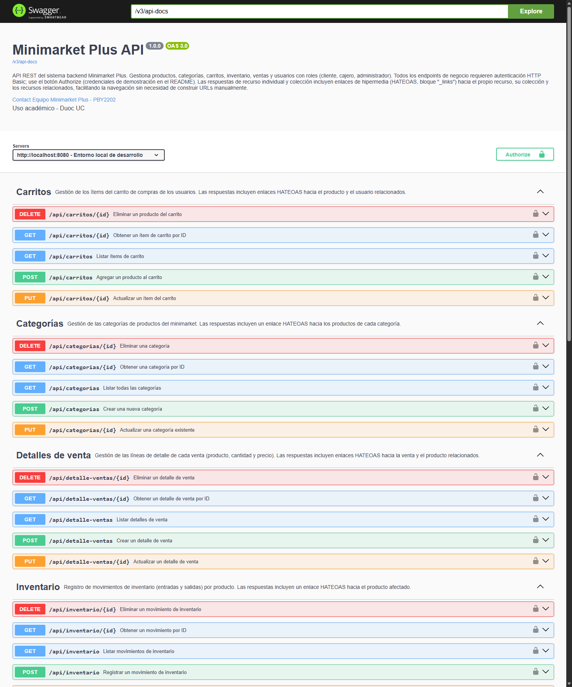
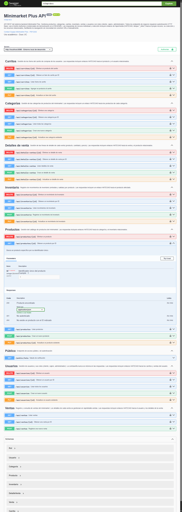
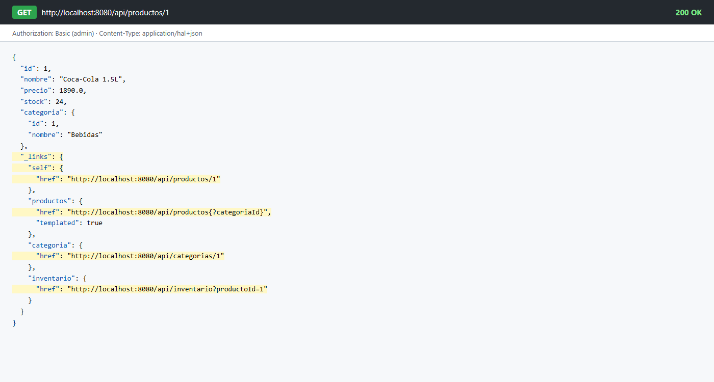
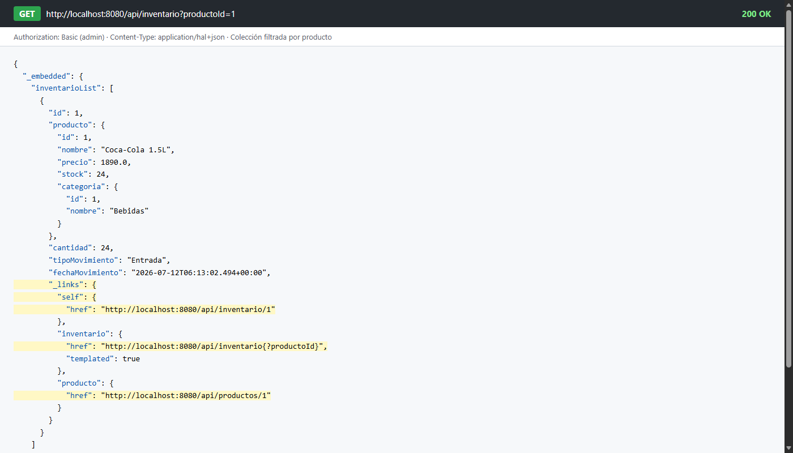
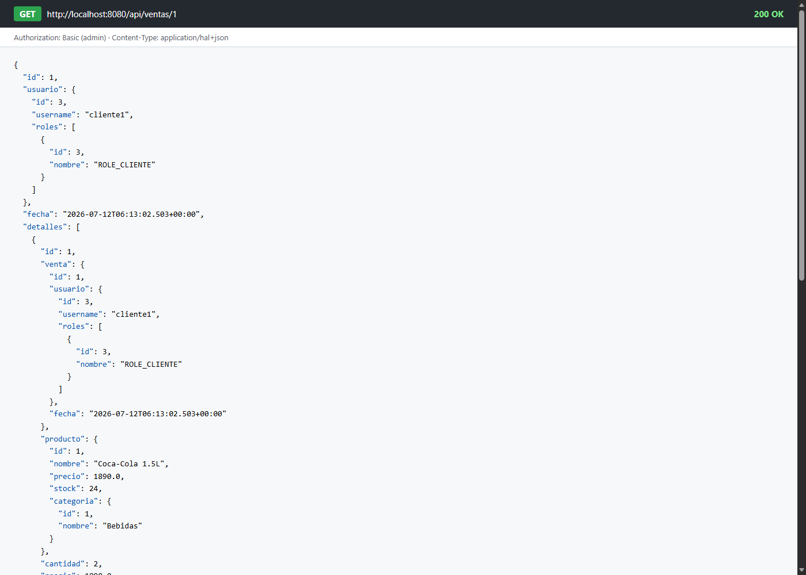
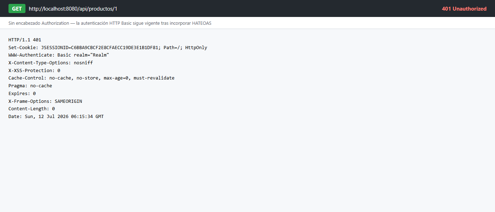
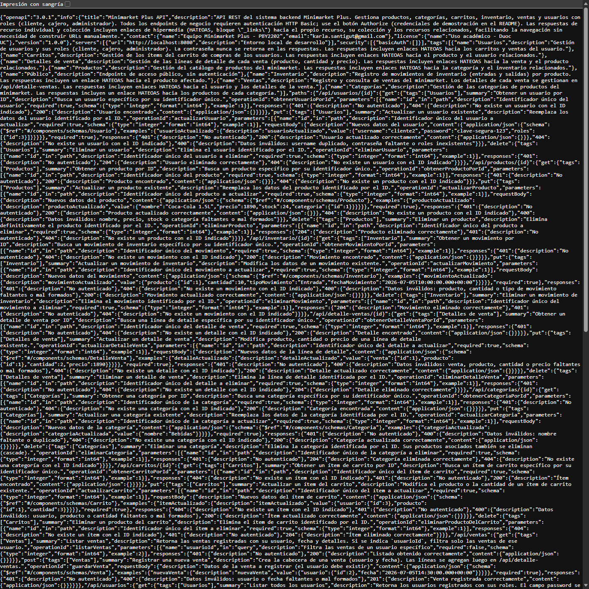

# Semana 8 — Desarrollo Backend II (PBY2202)

## Implementación Avanzada de Documentación en Microservicios con OpenAPI y HATEOAS

**Formato de respuesta — Grupo 7**

- **Asignatura**: Desarrollo Backend II (PBY2202)
- **Carrera**: Ingeniería en Informática, Duoc UC
- **Fecha**: 2026-07-11
- **Repositorio**: rama `feat/hateoas-s8` (integra `feat/security-spring-security-s1` → `feat/jwt-auth-authorization-s2` → `feat/integrating-security-backend-s3` → `feat/unit-test-s4` → `feat/microservices-junit-s6` → `feat/openapi-docs-s7`)
- **Especificación técnica**: [`specs/001-hateoas-openapi-avanzado/`](../../specs/001-hateoas-openapi-avanzado/) (spec, plan, research, data-model, contratos y tareas generados con spec-kit)

---

## 1. Resumen técnico del avance respecto a semanas anteriores

El backend de Minimarket Plus llega a esta semana con el trabajo acumulado de las semanas 1 a 7: autenticación con Spring Security (S1), utilidades JWT (S2), filtros e inicialización de seguridad (S3), pruebas unitarias con JUnit (S4), cobertura ampliada con JaCoCo (S5/S6), y documentación OpenAPI 3 con springdoc + Swagger UI (S7). Sobre esa base, la Semana 8 agrega dos capacidades nuevas sin modificar el modelo de datos existente:

1. **Documentación OpenAPI más completa**: se agregaron respuestas `400 Bad Request` a las operaciones `POST`/`PUT` de los 7 controladores de negocio (Producto, Categoría, Carrito, Inventario, Usuario, Venta, Detalle de Venta), que antes solo documentaban `401`/`404`. También se amplió la descripción global del contrato (`OpenApiConfig`) y el `README.md` para explicar el nuevo formato de respuesta con enlaces.
2. **HATEOAS**: se agregó la dependencia `spring-boot-starter-hateoas` y un `RepresentationModelAssembler` por entidad (paquete `com.minimarket.assembler`) que envuelve cada respuesta en `EntityModel`/`CollectionModel` con enlaces `self`, colección y relaciones de negocio reales (FK del modelo JPA existente).

El trabajo de autenticación, pruebas unitarias y documentación OpenAPI de las semanas previas fue lo que permitió abordar esta etapa sin fricción: la autenticación HTTP Basic ya configurada en S7 no requirió cambios (los nuevos enlaces heredan automáticamente la misma regla `.anyRequest().authenticated()`), y los repositorios ya tenían métodos `findByCategoriaId`, `findByProductoId`, `findByUsuarioId` y `findByVentaId` sin usar desde S1–S6, que se reutilizaron directamente como base de los enlaces relacionados en vez de tener que escribir consultas nuevas.

## 2. Análisis de la documentación generada

**¿Qué endpoints se documentaron con más detalle?** Los endpoints `POST`/`PUT` de los 7 controladores de negocio, que ahora documentan explícitamente el escenario `400` (datos inválidos), además de los `401`/`404` ya existentes desde S7. Los endpoints `GET` de colección (`/api/productos`, `/api/inventario`, `/api/carritos`, `/api/ventas`, `/api/detalle-ventas`) se documentaron con su nuevo parámetro de consulta opcional (`categoriaId`, `productoId`, `usuarioId`, `ventaId`) vía `@Parameter`.

**¿Qué dificultades encontraste al integrar HATEOAS y cómo las solucionaste?**

- *Enlaces hacia colecciones filtradas*: para que `producto → inventario` o `categoria → productos` fueran enlaces reales y no solo el listado completo, hacía falta un endpoint capaz de filtrar por la entidad relacionada. En vez de crear rutas anidadas nuevas (`/api/productos/{id}/inventario`), se detectó que los repositorios ya tenían los métodos `findByXxxId` sin usar desde semanas anteriores, y simplemente se expusieron como `@RequestParam(required = false)` en los `GET` de colección existentes.
- *Enlaces "vacíos" cuando el parámetro es nulo*: al construir el enlace `self` de la colección sin filtro con `linkTo(methodOn(...).listarX(null))`, Spring HATEOAS genera automáticamente una URI *templated* (`/api/productos{?categoriaId}`) en vez de fallar o generar una URL inválida — se ajustaron las pruebas para aceptar esa forma en vez de esperar una URL fija.
- *Coherencia entre la documentación OpenAPI y la respuesta real*: al cambiar el tipo de retorno de los controladores de `Producto` a `EntityModel<Producto>`, los `@Schema(implementation = Producto.class)` explícitos en las respuestas `200`/`201` habrían ocultado el bloque `_links` en Swagger UI. Se optó por remover ese `@Schema` fijo en las respuestas de éxito y dejar que springdoc infiera el esquema real desde el tipo de retorno del método, que ya incluye los enlaces.

**¿Qué mejoras realizaste para cumplir los estándares del proyecto?** Se mantuvo el patrón ya establecido en S7 (controladores delgados, anotaciones `@Operation`/`@ApiResponses` explícitas, sin Lombok) agregando una única capa nueva (`assembler`), que es el patrón estándar recomendado por Spring HATEOAS para no duplicar la construcción de enlaces en cada método de cada controlador.

## 3. Evidencia de ejecución

Los siguientes escenarios (detallados en [`specs/001-hateoas-openapi-avanzado/quickstart.md`](../../specs/001-hateoas-openapi-avanzado/quickstart.md)) se ejecutaron localmente contra `http://localhost:8080` con los datos de demostración cargados por `DataLoader`. Las capturas originales están en [`doc/img/s8/`](../img/s8/).

### a) Swagger UI con los 7 recursos documentados

Vista general de Swagger UI: los 7 recursos de negocio agrupados con su descripción (mencionando los enlaces HATEOAS de cada uno) y el botón **Authorize** para HTTP Basic.



Operación `GET /api/productos/{id}` expandida, con su parámetro documentado (`id`, con ejemplo) y las respuestas `200`, `401` y `404`:



### b) Recurso individual con enlaces HATEOAS

`GET /api/productos/1` (autenticado como `admin`) devuelve el producto envuelto con su bloque `_links` — enlaces `self`, `productos` (colección), `categoria` e `inventario` resaltados:



```json
{"id":1,"nombre":"Coca-Cola 1.5L","precio":1890.0,"stock":24,"categoria":{"id":1,"nombre":"Bebidas"},
 "_links":{
   "self":{"href":"http://localhost:8080/api/productos/1"},
   "productos":{"href":"http://localhost:8080/api/productos{?categoriaId}","templated":true},
   "categoria":{"href":"http://localhost:8080/api/categorias/1"},
   "inventario":{"href":"http://localhost:8080/api/inventario?productoId=1"}}}
```

### c) Colección filtrada por relación

`GET /api/inventario?productoId=1` devuelve únicamente los movimientos de ese producto, con `_links.self` apuntando a la misma URL filtrada y cada elemento embebido con su propio `_links.self` y `_links.producto`:



### d) Navegación venta → detalles

`GET /api/ventas/1` incluye `_links.detalles` apuntando a `/api/detalle-ventas?ventaId=1`, que al seguirse devuelve exactamente las 2 líneas de esa venta:



### e) Regresión de seguridad

`GET /api/productos/1` sin credenciales devuelve `401 Unauthorized` con el header `WWW-Authenticate: Basic`, igual que antes de incorporar HATEOAS (sin degradación de la autenticación existente):



### f) Contrato OpenAPI exportado

El contrato actualizado expuesto en `/v3/api-docs` (15 rutas), exportado a [`openapi/api-docs.json`](../../openapi/api-docs.json) e importable en Postman con Basic Auth:



### g) Pruebas automatizadas

Se agregaron 6 pruebas nuevas (`ProductoControllerHateoasTest`, `VentaControllerHateoasTest`, `HateoasSecurityRegressionTest`) que verifican programáticamente los puntos (b)-(e). El suite completo (`./mvnw test`) pasa **7/7 pruebas** con `BUILD SUCCESS`.

## 4. Reflexión técnica

**¿Cómo aporta OpenAPI junto a HATEOAS a la calidad, mantenibilidad y navegabilidad del backend?** OpenAPI documenta el contrato "estático" (qué endpoints existen, qué reciben y qué códigos retornan), mientras que HATEOAS documenta el contrato "dinámico" en tiempo de ejecución: un cliente que obtiene un producto no necesita conocer de antemano que `/api/inventario` acepta `?productoId=`, porque la propia respuesta se lo indica mediante `_links.inventario`. Esto reduce el acoplamiento entre el cliente y la estructura de URIs del backend (si una ruta cambiara, los clientes que navegan por enlaces no se rompen), y hace que agregar un octavo recurso en el futuro sea consistente con el patrón ya establecido (un assembler nuevo, sin tocar los siete existentes).

**¿Qué estrategias usarás para mantener actualizada esta documentación en versiones futuras?** Mantener la regla de que todo controlador nuevo debe: (1) tener su propio `RepresentationModelAssembler`, (2) documentar explícitamente `400`/`401`/`404` según corresponda, y (3) exponer parámetros de filtro sobre las FK reales del modelo en vez de rutas anidadas nuevas — siguiendo las decisiones registradas en [`research.md`](../../specs/001-hateoas-openapi-avanzado/research.md). Además, exportar `openapi/api-docs.json` como parte del checklist de cada entrega (ya incorporado en `quickstart.md`) evita que el contrato documentado quede desactualizado respecto al código.

## 5. Preguntas de apoyo

**¿Qué entidades necesitaron más trabajo para definir correctamente los enlaces HATEOAS?** `Producto`, por ser el nodo central del modelo de datos: participa en relaciones con `Categoria` (N:1), `Inventario` (1:N inverso vía `productoId`), `Carrito` y `DetalleVenta`. Fue la entidad con más enlaces salientes (`categoria`, `inventario`, además de `self` y `productos`) y la que más assemblers de otras entidades referencian (`CarritoModelAssembler`, `InventarioModelAssembler`, `DetalleVentaModelAssembler` todos enlazan de vuelta a `ProductoController`).

**¿Cómo detectaste y corregiste inconsistencias en los contratos?** Ejecutando las pruebas `MockMvc` contra la aplicación real (con `DataLoader` ya sembrando datos) en vez de solo revisar el código: la primera ejecución del suite reveló que el enlace `self` de una colección sin filtro se genera como URI *templated* (`/api/productos{?categoriaId}`) en vez de una URL plana, lo que llevó a documentar ese comportamiento en el contrato ([`contracts/hateoas-links.md`](../../specs/001-hateoas-openapi-avanzado/contracts/hateoas-links.md)) y a ajustar la prueba correspondiente.

**¿Qué valor agregado entrega esto para los desarrolladores que utilicen el API?** Pueden integrar el backend explorando solo Swagger UI y siguiendo enlaces reales desde una respuesta de ejemplo, sin necesidad de leer el código fuente de los controladores ni adivinar convenciones de URL para relaciones (por ejemplo, no necesitan saber que existe `?productoId=` en `/api/inventario`: el propio recurso `Producto` se lo indica).
